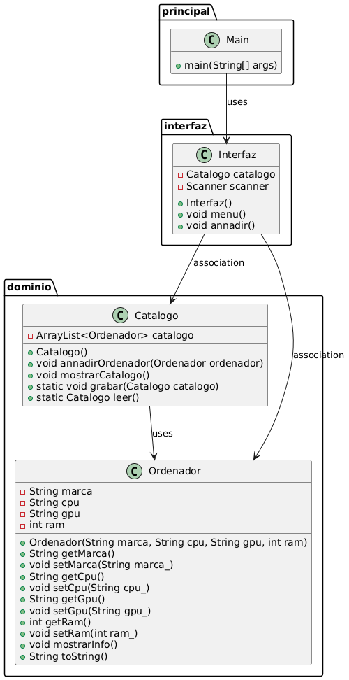

# Gestión de Ordenadores

Este proyecto es una aplicación simple para gestionar un catálogo de ordenadores. La aplicación está estructurada en varios paquetes y clases que permiten agregar, mostrar y almacenar información sobre los ordenadores.

## Guía de Instalación

Para instalar el proyecto, sigue estos pasos:

1. Clona el repositorio desde GitHub:

   ```bash
   git clone <enlace-de-tu-repositorio>

2. Navega al directorio del proyecto:
   ```bash
    cd nombre-del-directorio-del-proyecto    
3. Ejecuta la aplicación:
    ```bash
   java -cp bin principal.Main

## Estructura del Proyecto
El proyecto está dividido en los siguientes paquetes:

- principal: Contiene la clase Main.

- interfaz: Contiene la clase Interfaz.

- dominio: Contiene las clases Catalogo y Ordenador.

## Clases y Métodos
### principal.Main
Clase principal que inicia la aplicación.

Métodos:
- main(String[] args)

### interfaz.Interfaz
Clase que representa la interfaz de usuario.

Atributos:
- Catalogo catalogo

- Scanner scanner

Métodos:

- Interfaz()

- void menu()

- void annadir()

### dominio.Catalogo
Clase que representa un catálogo de ordenadores.

Atributos:

- ArrayList<Ordenador> catalogo

Métodos:

- Catalogo()

- void annadirOrdenador(Ordenador ordenador)

- void mostrarCatalogo()

- static void grabar(Catalogo catalogo)

- static Catalogo leer()

### dominio.Ordenador
Clase que representa un ordenador.

Atributos:

- String marca

- String cpu

- String gpu

- int ram

Métodos:

- Ordenador(String marca, String cpu, String gpu, int ram)

- String getMarca()

- void setMarca(String marca_)

- String getCpu()

- void setCpu(String cpu_)

- String getGpu()

- void setGpu(String gpu_)

- int getRam()

- void setRam(int ram_)

- void mostrarInfo()

- String toString()

## Ejecución
Para ejecutar la aplicación, compila y ejecuta la clase Main en el paquete principal.

## Uso
Las instrucciones disponibles en la interfaz de usuario son:

- 1 = añadir: Añade un nuevo ordenador al catálogo.

- 2 = listar: Muestra el catálogo de ordenadores.

- 3 = salir: Guarda el catálogo y finaliza la aplicación.

## Diagrama UML
El siguiente diagrama muestra la estructura del proyecto:


## Requisitos
Java SE Development Kit (JDK) 8 o superior.

## Autor
Este proyecto fue creado por Luis Holgado Arranz y Nicolas Lopez Fernandez.

## Licencia
Este proyecto está bajo la Licencia Apache. Puedes ver el archivo LICENSE para más detalles.


